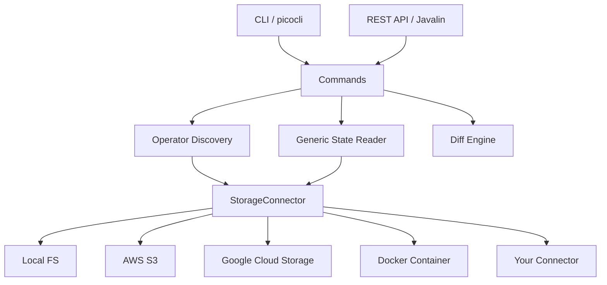

# Flink State Inspector

Auto-discovery CLI for inspecting Apache Flink savepoint and checkpoint state. Point it at a savepoint and it tells you what's inside, no custom reader classes required.

## Why

Flink's State Processor API requires you to write a `KeyedStateReaderFunction` for every operator, with exact state descriptors matching your production job. That means maintaining a parallel codebase just to debug state. This tool eliminates that by auto-discovering operators, state names, and serializer metadata directly from the savepoint's `_metadata` file.

## Features

- **Auto-discovery**: reads the `_metadata` file to find all operators, state names, and types automatically
- **Generic deserialization**: handles built-in Flink types (String, Long, POJO, Avro, Protobuf) without domain-specific code
- **Pluggable storage**: abstract `StorageConnector` class with built-in support for local filesystem, S3, GCS, and Docker containers
- **Multiple interfaces**: CLI commands, interactive browser, REST API
- **State diff**: compare state between two savepoints to see what changed

## Quick Start

```bash
# Build the fat JAR
mvn package -DskipTests

# List checkpoints at a path
java -jar target/flink-state-inspector.jar list /path/to/checkpoints

# Inspect state in a savepoint
java -jar target/flink-state-inspector.jar inspect /path/to/savepoint

# Inspect a specific operator
java -jar target/flink-state-inspector.jar inspect /path/to/savepoint --operator my-operator-uid

# Diff two savepoints
java -jar target/flink-state-inspector.jar diff /path/to/savepoint-1 /path/to/savepoint-2

# Interactive browser
java -jar target/flink-state-inspector.jar browse /path/to/checkpoints

# Start REST API
java -jar target/flink-state-inspector.jar serve --port 9741
```

## Storage Connectors

The tool reads checkpoint data from multiple storage backends. The URI scheme determines which connector is used:

| Scheme | Connector | Example |
|--------|-----------|---------|
| (none) | Local filesystem | `/data/flink/checkpoints` |
| `s3://` | AWS S3 | `s3://my-bucket/flink/checkpoints` |
| `gs://` | Google Cloud Storage | `gs://my-bucket/flink/checkpoints` |
| `docker://` | Docker container | `docker://flink-taskmanager/opt/flink/checkpoints` |

### Docker Connector

For local development with Docker Compose, the Docker connector reads checkpoints directly from inside running containers using `docker exec` and `docker cp`:

```bash
# List checkpoints inside a Flink TaskManager container
java -jar target/flink-state-inspector.jar list docker://flink-taskmanager/opt/flink/checkpoints
```

### Custom Connectors

Extend the `StorageConnector` abstract class to add support for additional storage backends (HDFS, Azure Blob Storage, MinIO, etc.):

```java
public class HdfsStorageConnector extends StorageConnector {

    @Override
    public String scheme() {
        return "hdfs";
    }

    @Override
    public void initialize(Map<String, String> config) {
        // set up HDFS client
    }

    // implement remaining abstract methods...
}
```

Register your connector in `StorageConnectorFactory.resolveConnector()`.

## Architecture



## CLI Commands

| Command | Description |
|---------|-------------|
| `list <path>` | Find and list checkpoints/savepoints at a storage path |
| `inspect <path>` | Auto-discover operators and display state |
| `diff <path1> <path2>` | Compare state between two savepoints |
| `browse [path]` | Interactive terminal browser |
| `serve --port 9741` | Start REST API server |

### Inspect Options

```
--operator, -o    Filter by operator UID
--state, -s       Filter by state name
--keys-only, -k   Show only state keys, not values
--key-filter      Filter entries by key pattern
--json            Output as raw JSON
--pretty          Pretty-print JSON (default: true)
--output, -O      Export results to file
```

## Custom Types

For jobs using custom POJO or Avro types, add your application JAR to the classpath:

```bash
java -cp flink-state-inspector.jar:my-flink-app.jar \
  io.flinkstate.inspector.FlinkStateInspector inspect /path/to/savepoint
```

Built-in Flink types (String, Long, Integer, Maps, Lists) work without additional JARs.

## Building

Requires JDK 17+.

```bash
mvn verify          # compile + test
mvn package         # build fat JAR
```

## Project Status

This project is under active development. See the [issue tracker](https://github.com/atomicdragonranch/flink-state-inspection-tool/issues) for the current roadmap.

**Implemented:**
- Storage connector abstraction with Local and Docker connectors
- CLI framework with all command stubs
- Checkpoint discovery and listing

**In progress:**
- Operator auto-discovery from savepoint metadata (#1)
- Generic state reader (#2)
- S3 and GCS connectors (#3, #4)

## License

[MIT](LICENSE)
