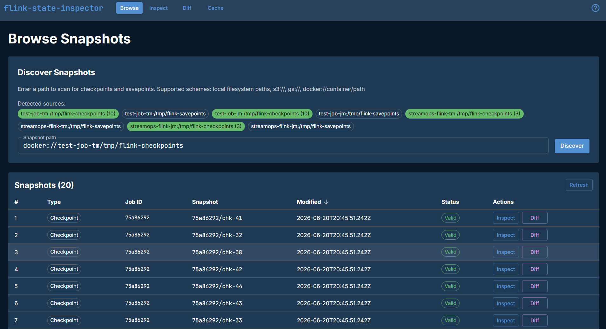
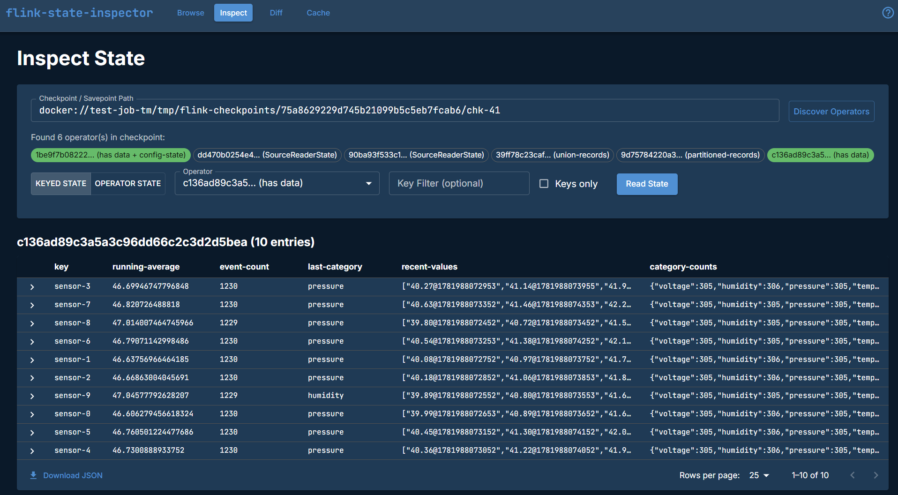
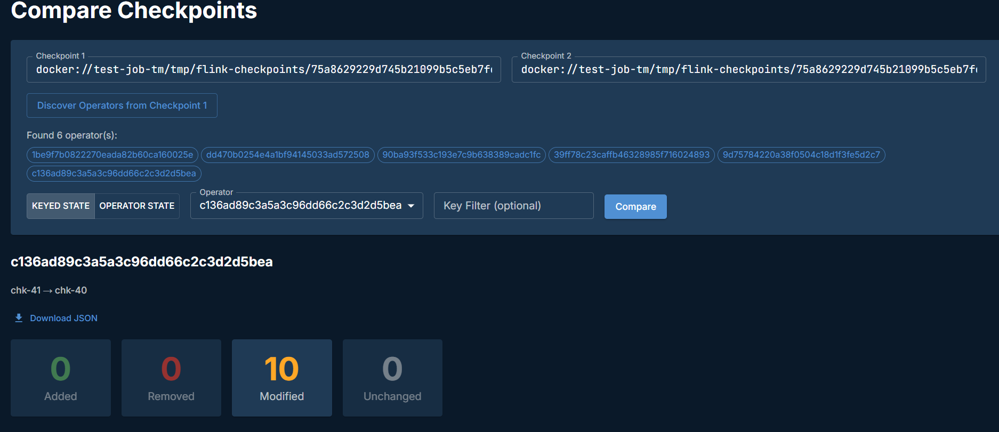
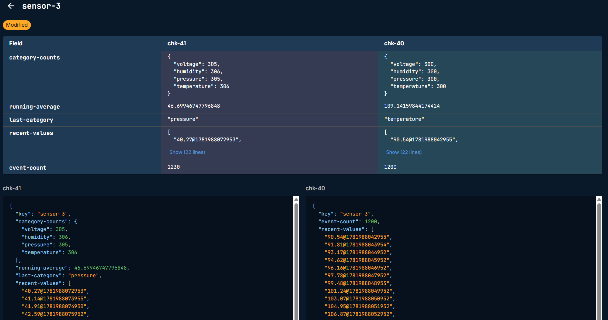
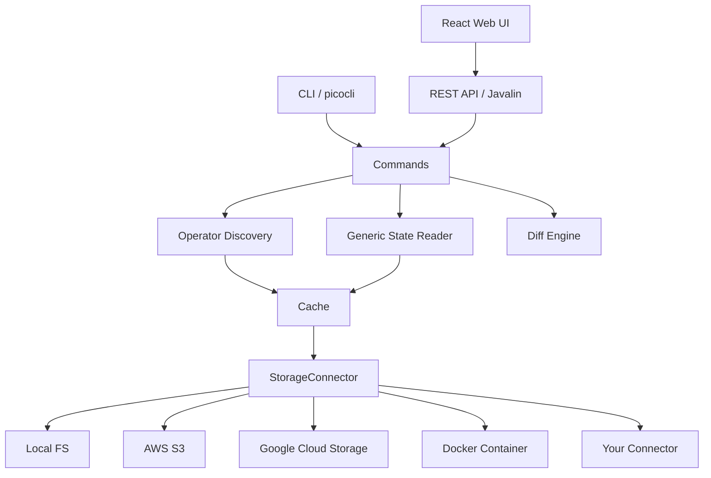

# Flink State Inspector

Auto-discovery tool for inspecting Apache Flink savepoint and checkpoint state. Select an environment, pick a checkpoint, choose an operator, and browse the state. No custom reader classes required.

## Why

Flink's State Processor API requires you to write a `KeyedStateReaderFunction` for every operator, with exact state descriptors matching your production job. That means maintaining a parallel codebase just to debug state. This tool eliminates that by auto-discovering operators, state names, and serializer metadata directly from the savepoint's `_metadata` file.

Compatible with savepoints from Flink 1.x and 2.x (the State Processor API maintains backward compatibility across versions).

## Features

- **Web UI**: React dashboard for browsing, inspecting, and diffing state with guided navigation
- **Auto-discovery**: reads the `_metadata` file to find all operators, state names, and types automatically
- **Source detection**: automatically finds running Flink Docker containers and their checkpoint paths
- **Direct SST reading**: reads RocksDB SST files directly using `SstFileReader`, bypassing the State Processor API's `SavepointReader` and its requirement for a MiniCluster
- **Generic deserialization**: handles built-in Flink types (String, Long, Double, Integer, POJO, Avro, Protobuf) without domain-specific code. Uses a `LenientClassLoader` that generates stub bytecode for missing application classes, so checkpoint metadata loads without the original job's dependencies
- **Pluggable storage**: abstract `StorageConnector` class with support for local filesystem, S3, and Docker containers (GCS planned)
- **State diff**: select two checkpoints and compare state side-by-side to see what changed
- **CLI**: full command-line interface for scripting and automation

## Web UI

### Screenshots

| Browse | Inspect | Diff |
|--------|---------|------|
|  |  |  |
| Checkpoint discovery and listing | Keyed state entries with expandable JSON | Side-by-side state comparison |


*Field-level comparison between two checkpoints*

The primary interface is a React web dashboard served by the built-in Javalin server:

```bash
java -jar target/flink-state-inspector.jar serve --port 9741
```

Open http://localhost:9741 in your browser. The UI guides you through:

1. **Browse**: enter a path or click a detected source to auto-populate. The tool discovers all available checkpoints and savepoints, displayed in a sortable, filterable table. Running Docker containers with Flink checkpoint directories are detected automatically.
2. **Inspect**: pick a checkpoint, and operators are auto-discovered. Select an operator to browse its keyed state entries. Expandable rows show full JSON state values. Supports key filtering and keys-only mode. The full checkpoint is cached locally on operator discovery, so state reads are immune to checkpoint rotation.
3. **Diff**: select two checkpoints to compare. The tool shows added, removed, and modified state entries across operators.
4. **Docs**: in-app documentation and API reference.

## CLI

For scripting and automation, the same functionality is available via CLI commands:

```bash
# Build the fat JAR
mvn package -DskipTests

# List checkpoints at a path
java -jar target/flink-state-inspector.jar list /path/to/checkpoints

# Inspect state in a savepoint (auto-discovers all operators)
java -jar target/flink-state-inspector.jar inspect /path/to/savepoint

# Inspect a specific operator
java -jar target/flink-state-inspector.jar inspect /path/to/savepoint --operator my-operator-uid

# Diff two savepoints
java -jar target/flink-state-inspector.jar diff /path/to/savepoint-1 /path/to/savepoint-2

# Interactive terminal browser
java -jar target/flink-state-inspector.jar browse /path/to/checkpoints
```

### CLI Options

```
inspect:
  --operator, -o    Filter by operator UID
  --state, -s       Filter by state name
  --keys-only, -k   Show only state keys, not values
  --key-filter      Filter entries by key pattern
  --json            Output as raw JSON
  --output, -O      Export results to file

diff:
  --operator, -o    Filter by operator UID
  --keys-only, -k   Compare keys only, ignore values

list:
  --limit, -n       Max entries to show (default: 20)
```

## Storage Connectors

The tool reads checkpoint data from multiple storage backends. The connector is selected automatically by URI scheme:

| Scheme | Connector | Example |
|--------|-----------|---------|
| (none) | Local filesystem | `/data/flink/checkpoints` |
| `s3://` | AWS S3 | `s3://my-bucket/flink/checkpoints` |
| `gs://` | Google Cloud Storage | `gs://my-bucket/flink/checkpoints` |
| `docker://` | Docker container | `docker://flink-taskmanager/opt/flink/checkpoints` |

### Docker Connector

For local development with Docker Compose, the Docker connector reads checkpoints directly from inside running containers:

```bash
java -jar target/flink-state-inspector.jar list docker://flink-taskmanager/opt/flink/checkpoints
```

### Custom Connectors

Extend the `StorageConnector` abstract class to add support for additional backends (HDFS, Azure Blob Storage, MinIO, etc.):

```java
public class HdfsStorageConnector extends StorageConnector {

    @Override
    public String scheme() {
        return "hdfs";
    }

    @Override
    public void initialize(Map<String, String> config) {
        // set up HDFS client
    }

    // implement remaining abstract methods...
}
```

Register your connector in `StorageConnectorFactory.resolveConnector()`.

## Architecture



## Custom Types

For jobs using custom POJO or Avro types, add your application JAR to the classpath:

```bash
java -cp flink-state-inspector.jar:my-flink-app.jar \
  io.flinkstate.inspector.FlinkStateInspector inspect /path/to/savepoint
```

Built-in Flink types (String, Long, Integer, Maps, Lists) work without additional JARs.

## Building

Requires JDK 17+ (tested with JDK 22) and Node.js 18+ (for the web UI).

```bash
mvn package              # compile + build fat JAR
cd ui && npm run build   # build web UI (for production)
cd ui && npm run dev     # start UI dev server (for development)
```

## Testing

### Unit Tests

```bash
mvn test
```

103 unit tests covering metadata parsing, operator discovery, state deserialization (keyed + operator), storage connectors, CLI options, API endpoints, diff logic, and path validation.

### Integration Tests

Requires Docker. Uses TestContainers with LocalStack for S3 connector tests.

```bash
mvn verify -Pintegration
```

11 integration tests covering S3 checkpoint discovery, validation, metadata reading, full checkpoint download, directory listing, and temp directory cleanup.

### Testing Against a Live Flink Job

To test with real checkpoint data, run a Flink job with RocksDB checkpointing in Docker Compose. Point the inspector at the container:

```bash
# List checkpoints from a running Flink container
java -jar target/flink-state-inspector.jar list docker://flink-jobmanager/tmp/flink-checkpoints

# Start the web UI and browse live state
java -jar target/flink-state-inspector.jar serve --port 9741
```

For best results, configure Flink to retain multiple checkpoints so they don't get cleaned up before inspection:

```yaml
execution.checkpointing.interval: 60s
state.checkpoints.num-retained: 3
```

## How It Works

Traditional Flink state inspection requires writing custom `KeyedStateReaderFunction` implementations with matching state descriptors, and running them through a `SavepointReader` that spins up a MiniCluster. This tool takes a different approach:

1. **Metadata parsing**: reads the checkpoint `_metadata` file using `KeyedBackendSerializationProxy` to extract operator IDs, state descriptor names, key/value serializer snapshots, and max parallelism
2. **Direct SST access**: resolves `IncrementalRemoteKeyedStateHandle` entries to individual RocksDB SST files. Handles both file-backed (`RelativeFileStateHandle`) and inline (`ByteStreamStateHandle`) storage
3. **Column family mapping**: uses `SstFileReader.getTableProperties().getColumnFamilyName()` to map each SST file to its Flink state descriptor
4. **Key deserialization**: uses `CompositeKeySerializationUtils` to skip the key group prefix and deserialize keys with the discovered key serializer
5. **Value deserialization**: restores value serializers from snapshots and deserializes VALUE, LIST, and MAP state types

This avoids the MiniCluster entirely, works without application classes on the classpath (via `LenientClassLoader`), and handles both shared and private state files from incremental checkpoints.

## Project Status

Under active development. See the [issue tracker](https://github.com/atomicdragonranch/flink-state-inspection-tool/issues) for the roadmap.

**Implemented:**
- Storage connector abstraction with Local, Docker, and S3 connectors
- CLI framework with all commands
- Checkpoint and savepoint discovery and listing
- Operator auto-discovery from checkpoint metadata
- Generic keyed state reader with direct SST file access
- Docker container auto-detection
- S3 storage with AWS SDK v2 (also works with LocalStack and MinIO)
- Web UI with browse, inspect, diff, and cache management views
- Checkpoint cache for re-inspection and diffing
- Raw bytes fallback for undeserializable state values
- Operator state reading (broadcast, union, split-distribute)
- Keyed and operator state diff comparison

**Planned:**
- GCS connector (#4)
- FRocksDB-format SST file support
- ReducingState and AggregatingState support (#17)

## License

[MIT](LICENSE)
